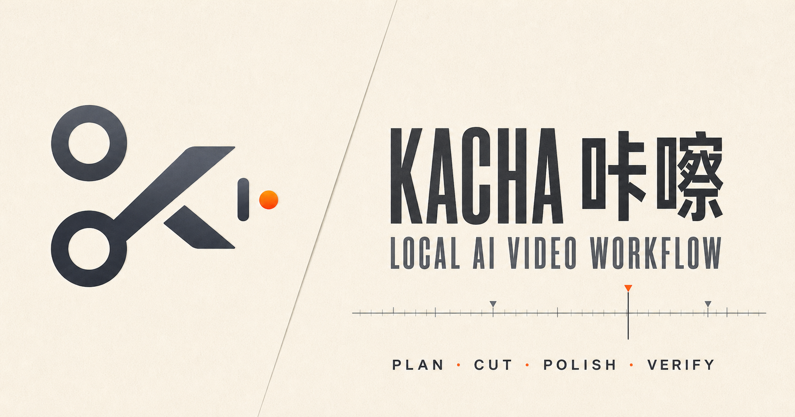
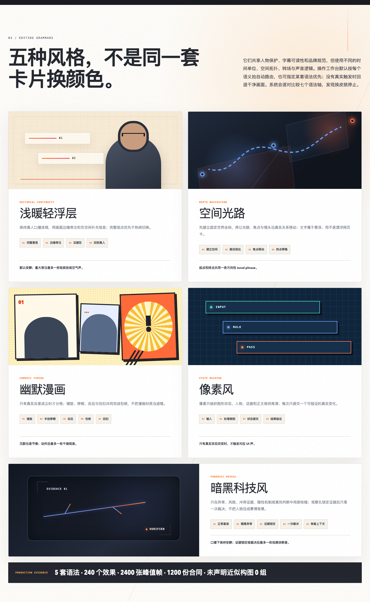
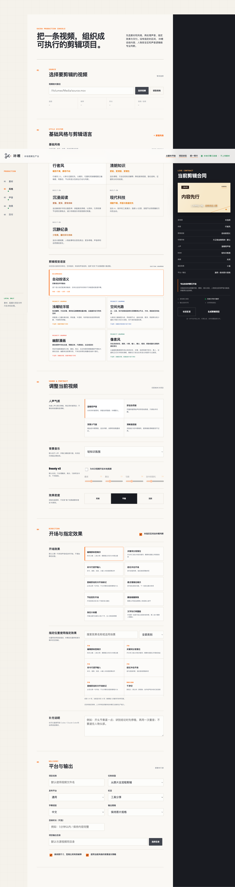

# Kacha

**Kacha** (`kacha`) is a local-first professional video workflow skill for **Codex** and **Claude Code**. It turns script-first planning or source editing, packaging, unified review, technical QC, and revision into explicit, recoverable, fail-closed gates.

[中文说明](README.md) · [Production Studio in Figma](https://www.figma.com/design/uXfiviOI5rgi56awnD3Iut?node-id=1-2) · [One-prompt install](docs/en/AGENT_INSTALL.md) · [Quick start](docs/en/QUICKSTART.md) · [Performance and weak-model production](docs/en/PERFORMANCE_TOKEN_STABILITY_V5.md) · [Privacy and security](docs/en/PRIVACY_SECURITY.md)

<p align="center">
  
</p>

Kacha acts as a professional workflow layer. For supported contracts it
compiles a unified Timeline IR into a deterministic FFmpeg Render Graph, while
coordinating a verified NLE, Remotion, HyperFrames, or another selected engine
under the same content, timing, and acceptance contracts. Final creative
decisions and human approval remain explicit.

## Official site and product design

Official site: **[https://colorcross.github.io/kacha/](https://colorcross.github.io/kacha/)**

Chinese: [https://colorcross.github.io/kacha/](https://colorcross.github.io/kacha/) ·
English: [https://colorcross.github.io/kacha/en/](https://colorcross.github.io/kacha/en/)

The bilingual official-site source lives in [`website/`](website/) and is
built and deployed to GitHub Pages by GitHub Actions. Logo usage,
color, typography, grid, components, motion, accessibility, and copy boundaries
are governed by the
[product brand and website system](docs/en/PRODUCT_BRAND_AND_WEBSITE.md).
The verified completion matrix is recorded in the
[2026-07-29 completion review](docs/en/COMPLETION_REVIEW_2026-07-29.md).

The scissors represent selection and editing, the play/K geometry represents
video and Kacha, and the orange dot is the active cut point and verified action.
The site intentionally avoids generic purple AI gradients, neon, and one-click
magic claims.

## See Kacha in action

Scan or open the full-size images to follow **行者大灰** and see editing demonstrations, before-and-after comparisons, and workflow examples.

<table>
  <tr>
    <th align="center">WeChat Channels</th>
    <th align="center">Douyin</th>
    <th align="center">Xiaohongshu</th>
  </tr>
  <tr>
    <td align="center" valign="top">
      <a href="assets/social/wechat-channels.jpg">
        
      </a>
    </td>
    <td align="center" valign="top">
      <a href="assets/social/douyin.png">
        
      </a>
    </td>
    <td align="center" valign="top">
      <a href="assets/social/xiaohongshu.jpg">
        
      </a>
    </td>
  </tr>
</table>

## What it does

- Builds auditable edit proposals with source hashes, authorization boundaries, success criteria, and fallbacks.
- Adds a v3 incremental path for approved baselines: record only the current
  delta, reuse fingerprinted artifacts, render affected layers, and prove
  frozen streams unchanged.
- Gives lower-capability models a deterministic `prepare → next` protocol,
  stable error codes, and compiled change recipes instead of relying on
  high-reasoning improvisation.
- Keeps chat with Codex or Claude Code as the primary interface while a local
  Agent control plane handles compact mutation deltas, on-device semantic media
  lookup, terminal-state-safe background jobs with verified placeholders,
  deterministic object-level `@` references,
  and Codex/Claude installation status.
- Adds an exact 120,000-tick timebase with rational frame rates, a typed
  Timeline Projection, and a snapshot-backed Command Journal for allowlisted
  apply/undo/redo operations. The localhost `/editor` surface remains a
  correction workbench, not a second timeline source.
- Extends that workbench with multi-select snapping, trim/split/explicit EDL
  reorder, markers, a work area, delivery-frame guides, bounded asynchronous
  waveforms, a license-visible Project Bin, and overlay `x/y` keyframes that
  compile into the canonical FFmpeg final graph.
  Studio verifies a declared source SHA-256 on open, frame-aligns playhead edits,
  and keeps editor history/snapshots private with mode `0600`.
- Exposes compact read and SHA-locked edit tools through a project-root-confined
  local stdio MCP server for Codex and Claude Code. MCP registration grants no
  upload, paid-call, final-render, publishing, or whole-project overwrite rights.
  Explicit installation is only accepted after readback matches the executable,
  server script, and complete confined root.
- Generates strong-identity technical rhythm evidence for scene-change, energy,
  onset, drop, and BPM candidates while explicitly denying semantic or
  authoritative beat-grid claims.
- Compiles an episode-level director plan with a narrative spine, exactly one
  opening, content priority, high-impact budget, deliberate quiet, five style
  grammars, fallbacks, and explicit evidence gaps.
- Provides a localhost unified review workbench for normal-speed semantic decisions and eleven release checks bound to the current final-video SHA-256,
  rationale, confidence, fallback, and explicit accept/adjust/reject decisions.
  An accepted decision is not publishing approval.
- Learns only transparent, evidence-counted preference candidates from explicit
  review decisions. Activation is confirmed, versioned, reversible, and never
  stores freeform review notes in the long-term profile.
- Measures human-reviewed first-draft usability, semantic damage, manual
  intervention, connection rejection, caption correction, and style grammar
  violations. Improvement claims require at least eight paired source groups.
- Exports OTIO, FCPXML, and CMX3600 while preserving Kacha semantic IDs where
  supported. OTIO/FCPXML imports always create a candidate timeline and never
  overwrite the Timeline IR baseline.
- Routes context through five bounded packets while an ordered 13-stage state
  machine accepts only current file-backed evidence. Full word-level
  transcripts stay out of prompts; Agents read at most 180 seconds at a time.
- Compiles EDL, breathing motion, overlays, captions, dialogue, BGM, and SFX
  into one Render Graph, with at most one full video encode for a final visual
  version and zero encodes for an exact verified reuse. Every contract, media
  layer, caption file, and font directory is frozen by content identity.
- Reuses content-addressed Demucs, ASR, mask/tracking, Beauty, styleframe, and
  generated-media artifacts with model/service fingerprints; paid generation
  is not resubmitted on an exact cache hit.
- Records wall time, measured/estimated token provenance, cache hits, render
  range, video encode count, artifacts, and redacted logs. Heavy GPU/encode
  leases are host-scoped across projects.
- Builds a V8 quality-preserving efficiency plan from current evidence: exact
  representative ranges, dependency/resource waves, strong-fingerprint cache
  readiness, and mandatory full-candidate playback. It refuses efficiency
  claims before eight same-source, human-reviewed pairs pass every critical
  quality guardrail.
- Proves required BGM reached the final file by measuring audibility,
  reconstructing component stems, and comparing decoded final audio with the
  declared mix stem.
- Merges versioned parameters, user/project editing defaults, and local
  credentials through one validated configuration system. Editing defaults
  accept structured parameters and natural language without leaking keys into
  project artifacts.
- Provides a localhost-only production studio for starting from a script, topic, or source media, then tracking four recoverable milestones,
  reusable styles, openings, and natural-language-positioned effects, then
  compiling an auditable brief and project config without uploading media.
- Resolves a full video design system with show, aspect-ratio, language,
  surface, and density modes, plus 52 registered components, 69 reusable
  scenes, and 33 semantic net-style mechanisms validated from six reference
  videos without copying their assets. Timed transcripts can compile those
  mechanisms into a frame-accurate production plan, render them into the full
  picture-locked video, and verify hashes, resources, timing, geometry, audio,
  and the absence of demo labels.
- Gives all 240 registered effects five landscape/vertical visual languages and
  1,200 executable motion contracts. Light Warm Overlay, Spatial Light Path,
  Humor Comic, Pixel Editorial, and Dark Tech use different time units, spatial
  topology, transitions, and sound—not one card layout with new surface styling.
- Builds semantic visual-breathing timelines with push-in, hold, release,
  lateral drift, and emphasis-punch motion while preserving deliberate stillness.
- Lays out spoken captions as plain single lines or real left/right, top/bottom,
  and foreground/background information relationships, with functional SFX.
- Indexes authorized local fonts by metadata, glyph coverage, scene role, and
  file hash without redistributing the font binaries. The default Xingzhe
  style requires the licensed real Jinling typeface for spoken captions and
  fails closed instead of silently substituting the old fallback.
- Provides local Beauty v2 for skin smoothing, whitening, tone evening, and
  restrained nasolabial-fold softening. Beauty is disabled by default and does
  not use GPUPixel, cloud beautification, or generative face repair.
- Resolves 65 production effect templates across openings, transitions,
  semantic visuals, gaze guidance, spatial depth, keyframes, parallel
  typography, captions, and visual breathing, backed by original visual
  resources and license-aware query-time media slots.
- Ships 23 public core resources, including original margin-note, spatial-route,
  comic-beat, and pixel-state visual primitives. Private fonts and project media
  remain outside the public repository.
- Integrates a loopback FaceFusion candidate pipeline for consent-gated face
  swap, lip sync, face restoration, and frame post-processing. Every run
  freezes input hashes and model-license metadata and remains blocked from
  release until operation-specific manual QC is recorded.
- Produces local, machine-readable keyframe, face, person, OCR, luminance, and
  timestamp evidence for Claude Code. MiniMax may enrich a few frames only
  after external-upload, paid-service, and explicit command authorization;
  the whole video is never uploaded by this path.
- Validates semantic cuts, shot motivation, continuity, reframing, masks, picture-in-picture, subtitles, covers, and visual packaging.
- Provides Workbench V3 with independent timeline versions and aspect candidates, ripple trim and overwrite through the same reversible journal, a truthful capability map, agent activity, and a delivery center for closed codec plans and NLE interchange candidates.
- Coordinates dialogue preprocessing, voice enhancement, final mixing, and audio/video alignment.
- Bundles 12 creator-produced sound effects with exact titles, IDs, hashes, and a dedicated asset license.
- Requires local styleframes or an optional Figma handoff before implementing information cards, flowcharts, popups, stylized transitions, and masks.
- Audits the whole-film SFX palette and event map so one sound is not reused across every visual beat.
- Separates dialogue from non-dialogue audio before spoken-word processing, and keeps only the approved dialogue stem in the downstream chain.
- Detects an established series identity and carries the same series mark into both the video and its covers.
- Preserves the source video's pixel dimensions and aspect ratio unless the user explicitly requests a change.
- Turns SRT-driven line art into warm-paper whiteboard animation: subtitle-scoped streaming ink (ink then color), a fail-closed annotation contract, render evidence, per-scene technical QC, and multi-scene merging for explainer and story videos.
- Provides two-stage intermediate cleanup: routine cleanup only for user-unneeded, fast-regenerating caches, and final cleanup only after explicit no-more-edits confirmation.
- Records AI-generated shot plans with provider, model, capability snapshot, paid-call authorization, and QC targets.
- Runs automated media checks and requires separate human-review evidence before local release.
  The current full regression discovers 171 checks.
- Keeps uploads, publishing, purchases, and paid generation outside the default authorization boundary.

<p align="center">
  <a href="docs/en/FIVE_STYLE_EDITING_GRAMMARS.md">
    
  </a>
</p>

## Install by asking your Agent

Paste this into your current Codex or Claude Code session:

```text
Install the latest Kacha skill from https://github.com/colorcross/kacha.git. Detect whether you are Codex or Claude Code, inspect and run scripts/install.sh for the matching user-level skills directory, and do not overwrite an existing installation or upload any local files. If the target already exists, report it without changing it. Run the secret scan and regression tests, then immediately read the installed SKILL.md and the references required for my task so it is usable in this session. Report the install path, version, and verification results.
```

This asks the Agent to inspect the repository, install safely, verify it, and load the skill into the current session. See [One-prompt installation](docs/en/AGENT_INSTALL.md) for the exact behavior and alternatives.

## Command-line install

Codex:

```bash
curl -fsSL https://raw.githubusercontent.com/colorcross/kacha/main/scripts/install.sh \
  | bash -s -- --agent codex --channel canary
```

Claude Code:

```bash
curl -fsSL https://raw.githubusercontent.com/colorcross/kacha/main/scripts/install.sh \
  | bash -s -- --agent claude --channel canary
```

The website command explicitly chooses `canary`, which tracks `main`. Replace it
with `stable` for the last formally tagged line; stable is now `v1.2.0`. The installer refuses to overwrite an existing target.
The default locations are:

| Agent | User-level skill directory |
| --- | --- |
| Codex | `~/.codex/skills/kacha` |
| Claude Code | `~/.claude/skills/kacha` |

The installer needs Python 3, `curl`, and `tar`. Node.js 20+ is required for
the gates; FFmpeg, FFprobe, and `jq` are required for the full core workflow.
Local font indexing and caption overlays use Pillow and fontTools. Apple Vision
mask generation is macOS-only. See
[Installation and dependencies](docs/en/INSTALLATION.md).

## Configure editing defaults

Start the local production studio when you do not want to hand-author config:

```bash
node scripts/kacha.mjs studio serve
```

It listens on `127.0.0.1`, reads explicit local paths, and generates a new
project directory. Its five-step flow covers source, style, sound, effects,
and delivery. All 132 assignable effects are searchable, and project
generation is blocked until source media, the output directory, licensed font,
design system, and selected effects pass preflight. It does not upload,
overwrite, render, or publish by itself.

Track the project at `http://127.0.0.1:4179/project`. After a candidate is built, open `http://127.0.0.1:4179/review` to review
high-impact editing decisions at normal speed. The workbench records explicit
decisions and resolution evidence without granting upload, paid generation,
publishing, overwrite, or gate-bypass authority.

<p align="center">
  <a href="https://www.figma.com/design/uXfiviOI5rgi56awnD3Iut?node-id=1-2">
    
  </a>
</p>

```bash
node scripts/kacha.mjs config init --scope user
node scripts/kacha.mjs config show --anchor /path/to/project
node scripts/kacha.mjs design validate
node scripts/kacha.mjs design list --kind scene
```

User defaults live in `~/.config/kacha/config.json`. A project may commit
`kacha.config.json` and keep machine-only overrides in the ignored
`kacha.local.json`. `editingDefaults` supports structured `parameters`,
natural-language `instructions`, and incremental `recipeParameters`.

MiniMax, Pixabay, and Pexels keys may live in the `0600`
`~/.config/kacha/secrets.json`. Environment variables and the existing `mmx`
credential store remain supported. Configuration never grants upload, paid
call, publishing, overwrite, or gate-bypass authorization. Auto-discovered
project config cannot redirect providers, credential environment names, or
machine-local tools; those settings require user config or explicit
`--config`. See
[Configuration](docs/en/CONFIGURATION.md).

Visual configuration resolves
`style.system + style.profile + style.modes + style.overrides`; see
[Video Design System V1](docs/VIDEO_DESIGN_SYSTEM_V1.md). The resulting design
digest and implementation digest invalidate only dependent visual artifacts.
Beauty remains off unless
the project or current change request explicitly enables Beauty v2. Beauty
rendering also requires a frame-accurate Vision manifest; a technical pass is
reported separately from the required same-frame dynamic human review, and
the report freezes the full Beauty implementation-chain digest.

For a release-level design-system check:

```bash
node scripts/kacha.mjs design qc --matrix --output /tmp/design-system-qc.json
```

## Choose the correct task path

| Task path | Use it when | Stop condition |
| --- | --- | --- |
| `proposal_review` | You only want a reviewed editing proposal | Stop after `gate-plan` |
| `source_edit` | You have source media and want an edited deliverable | Continue through render, QC, and review |
| `content_generation` | You are turning a script or source material into a new video | Plan and verify every acquired or generated asset |
| `local_optimization` | You are changing a named layer or interval in an existing version | Freeze unaffected layers and rebuild current-version audit evidence |

Planning is not authorization to modify files. Rendering is not QC. Automated technical QC is not human approval. Local release is not upload or publication.

## The shortest complete workflow

### Lower-capability models and Claude Code

```bash
node scripts/kacha.mjs doctor --profile claude-vision
node scripts/kacha.mjs prepare \
  --task local_optimization --modules beauty \
  --agent claude --model-tier economy --project /path/to/project.json \
  --output /path/to/agent-packet.json
node scripts/kacha.mjs next /path/to/project.json
```

The Agent reads the packet's `readOrder`, then executes exactly one
`nextAction` at a time. Common changes can be compiled from
`examples/change-request.json`. Claude Code reads local
`visual-evidence.md/.json` first; MiniMax is an explicitly authorized optional
semantic layer, not a default dependency. `prepare` automatically routes the
economy-model and Claude visual support references, and fails closed when the
conservative multilingual token budget is exceeded.

### First edit or structural rebuild

```text
edit proposal + edit plan + source hashes
                    |
                 gate-plan
                    |
           capability snapshot
                    |
                gate-render
                    |
          project render engine
                    |
                    qc
                    |
         human review evidence
                    |
               gate-release
```

Typical commands:

```bash
node scripts/kacha.mjs gate-plan /path/to/project-manifest.json
scripts/capability_probe.sh --profile core --output /path/to/capabilities.json
node scripts/kacha.mjs gate-render /path/to/project-manifest.json
node scripts/kacha.mjs render /path/to/project-manifest.json
node scripts/kacha.mjs qc /path/to/project-manifest.json
node scripts/kacha.mjs gate-release /path/to/project-manifest.json

node scripts/kacha.mjs timeline migrate-timebase \
  --plan /path/to/timeline.json --output /path/to/timeline.v2.json
node scripts/kacha.mjs editor project --timeline /path/to/timeline.v2.json
node scripts/kacha.mjs editor recover --timeline /path/to/timeline.v2.json --expected-sha CURRENT_SHA
node scripts/kacha.mjs editor reopen --timeline /path/to/timeline.v2.json --expected-sha CURRENT_SHA
```

`gate-render` checks readiness; it does **not** render a timeline.
`render` executes a registered unified Timeline IR when the project has one.
The Studio Canvas view is always an approximate preview; only the canonical
FFmpeg Render Graph is final-eligible. WebGPU remains explicitly unimplemented
until a current golden parity corpus passes.
The approximate player maps output playhead time through the EDL to source time,
but it does not composite overlapping transitions. `recover` restores the last
verified snapshot after journal corruption; `reopen` explicitly accepts a valid
external Timeline change. Both archive the prior state and require the current SHA.
`qc` performs automated technical analysis; it does **not** create human-review
evidence. See [Quick start](docs/en/QUICKSTART.md),
[Architecture and boundaries](docs/en/ARCHITECTURE.md), and
[Performance and weak-model production](docs/en/PERFORMANCE_TOKEN_STABILITY_V5.md).

Use `route_references.mjs` to derive the minimum reference set for the selected
task and modules instead of loading every document into context.

### Local change on an approved baseline

```bash
node scripts/init_incremental_project.mjs BASE.mov \
  --project-id my-video --output-dir /path/to/project

node scripts/create_version_delta.mjs /path/to/project/project-context.json \
  --write /path/to/project/v2-delta.json --new-version v2 \
  --type beauty_adjust --output-video /path/to/project/v2.mov

node scripts/create_incremental_manifest.mjs \
  /path/to/project/project-context.json /path/to/project/v2-delta.json \
  /path/to/project/artifact-index.json \
  --output /path/to/project/v2-project.json

node scripts/kacha.mjs gate-plan /path/to/project/v2-project.json
node scripts/kacha.mjs qc /path/to/project/v2-project.json
node scripts/create_incremental_review.mjs /path/to/project/v2-project.json
node scripts/kacha.mjs gate-candidate /path/to/project/v2-project.json
```

A visual-only change proves the audio elementary stream unchanged; an
audio-only change proves the video stream unchanged. A `candidate` cannot pass
the release gate. Only a fully reviewed `release_candidate` can become a local
release.

## Repository layout

```text
SKILL.md           Agent entry point and routing rules
references/        Detailed workflow, editing, audio, visual, and QC contracts
scripts/           State machine, visual evidence, gates, media helpers, and scanning
config/            Public, credential-free runtime defaults
examples/          Fictional v2 full-edit and v3 incremental templates
assets/sfx/        12 original SFX, working copies, hashes, and asset license
assets/brand/      Logo and social-card assets
tests/             Regression and installer tests
docs/              Chinese documentation
docs/en/           English documentation
website/           Bilingual official site source, excluded from skill bundles
```

Keep real project media outside this repository. Treat source media as read-only and store project contracts, capability snapshots, renders, and review evidence in a separate project directory.

## Verification

From the repository root:

```bash
node tests/run_tests.mjs --suite incremental
node tests/run_tests.mjs --suite audio
node tests/run_tests.mjs --suite visual
node tests/run_tests.mjs --report /tmp/kacha-tests.json
bash tests/test_installer.sh
python3 scripts/scan_secrets.py
cd website && npm run lint && npm run typecheck && npm run test:pages && npm run audit:dependencies
```

Scoped suites generate only the media fixtures they need. Passing repository
tests proves that the included gates and fixtures behave as expected. It does
not prove that a real project has been rendered, watched, approved, uploaded,
or published. Website checks are a separate gate and do not replace the skill
regression suite.

## Privacy and security

Kacha is local-first by default. Do not commit real credentials, private media, model weights, render outputs, local capability snapshots, platform task IDs, or machine-specific absolute paths.

Before contributing:

```bash
python3 scripts/scan_secrets.py
git status --short
git diff --cached --check
```

The scanner reduces risk but cannot prove that a repository contains no sensitive information. Always review every staged file manually. See [Privacy and security](docs/en/PRIVACY_SECURITY.md) and [Security policy](SECURITY.md).

## Documentation

- [One-prompt Agent installation](docs/en/AGENT_INSTALL.md)
- [Installation and dependencies](docs/en/INSTALLATION.md)
- [Quick start](docs/en/QUICKSTART.md)
- [Configuration and credentials](docs/en/CONFIGURATION.md)
- [Architecture and design boundaries](docs/en/ARCHITECTURE.md)
- [Performance, token, and weak-model production](docs/en/PERFORMANCE_TOKEN_STABILITY_V5.md)
- [V6 editorial evaluation and semantic review](docs/en/INTELLIGENT_EDITING_V6.md)
- [Five-style editing grammar contract](docs/en/FIVE_STYLE_EDITING_GRAMMARS.md)
- [Product brand and website system](docs/en/PRODUCT_BRAND_AND_WEBSITE.md)
- [2026-07-29 completion review](docs/en/COMPLETION_REVIEW_2026-07-29.md)
- [Privacy and security](docs/en/PRIVACY_SECURITY.md)
- [Contributing](CONTRIBUTING.md)
- [Security policy](SECURITY.md)
- [Changelog](CHANGELOG.md)

## License

[MIT](LICENSE) for code and documentation. The bundled original SFX use the
dedicated [asset license](assets/sfx/LICENSE.md). The logo and social card use
the separate [brand-asset rules](assets/brand/README.md) and are not covered by
MIT. Third-party media, fonts, models, templates, and platform content are not
licensed by this repository.
