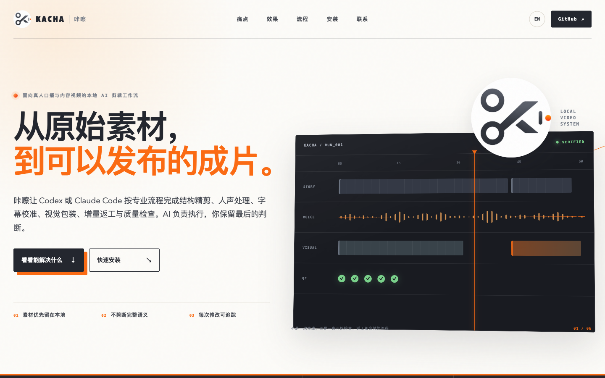

# 咔嚓（Kacha）

[](https://github.com/colorcross/kacha/actions/workflows/ci.yml)
[](https://colorcross.github.io/kacha/)
[](LICENSE)

<p align="center">
  
</p>

**咔嚓是一套支持 Codex 与 Claude Code 的本地、AI 辅助、证据化专业视频生产工作流 skill。**

它把脚本策划、精剪、声音、视觉包装、字幕、统一审片、增量返工和质量检查
组织成一条可恢复、可审计、可复现的流程。

它不是“一键全自动成片器”：内容判断、授权、正常速度审片和发布决定仍由人负责；
AI 负责组织证据、编译计划、执行获批修改并把技术结果留痕。

[官网](https://colorcross.github.io/kacha/) ·
[English site](https://colorcross.github.io/kacha/en/) ·
[生产台 Figma 设计稿](https://www.figma.com/design/uXfiviOI5rgi56awnD3Iut?node-id=1-2) ·
[English README](README.en.md) ·
[快速开始](docs/QUICKSTART.md) ·
[安装说明](docs/INSTALLATION.md)

<p align="center">
  <a href="https://colorcross.github.io/kacha/">
    
  </a>
</p>

## 它解决什么问题

很多 AI 剪辑方案只会生成效果，缺少完整工程闭环。咔嚓关注的是：

- **先把内容剪对**：删除无效停顿、口误和重复，同时保住完整语义与自然强弱；
- **再把声音和画面做好**：人声分离、降噪、增强、BGM/SFX、字幕、信息卡、
  PIP、蒙版、转场和主体感知重构图按同一套合同执行；
- **返工只动该动的部分**：冻结无关音视频流，复用已有产物，只重渲染受影响层；
- **结果必须可验证**：媒体解码、轨道、尺寸、响度、黑帧、冻帧、静音、
  全输入哈希、最终混音和人工审片分别留证，不把技术通过冒充可发布。

它作为专业工作流层，协调 FFmpeg、NLE、Remotion、HyperFrames 或项目指定
引擎，把不同工具的结果约束在同一套内容、时间线与验收合同中。

## 核心特点

| 能力 | 价值 |
| --- | --- |
| 本地优先 | 默认不上传素材；外传、付费生成和发布需要单独授权 |
| 本地生产台 | 选素材、基础风格、五套剪辑语言、开场和指定效果，生成可交给 Agent 执行的项目合同 |
| 四里程碑编排 | 方案确认、首剪确认、成片审阅、交付与返工共享运行版本、输入身份、证据和唯一下一步 |
| 脚本优先生产 | 没有视频也可先做内容主线、事实核查、录制计划、素材清单和 source-edit 交接 |
| 素材缺口收件箱 | 区分事实证据、用户素材与说明性生成候选，许可、来源、文件身份和重新索引缺一不可 |
| 完整工作流 | 从方案、精剪、声音、视觉、字幕一直走到候选版与发布门禁 |
| 增量返工 | 通过依赖图、产物指纹和冻结流哈希减少重复渲染 |
| 返工渲染预算 | 参数探索只跑代表区间；每版本最多一次整片代理、一次正式编码、一次完整 QC |
| 质量不降级效率 | 当前证据选择首剪/增量代表区间，按依赖和资源生成安全波次；完整候选通看保持强制 |
| 效率证据门禁 | 至少 8 个同源成对真人审片项目且六项关键护栏无退化，才允许宣称效率提升 |
| 一次正式编码 | EDL、动效、字幕和混音编译成统一 Render Graph，并冻结所有输入内容身份 |
| 高成本复用 | ASR、人声分离、蒙版、Beauty、样式帧和生成素材按模型/实现强指纹缓存 |
| 弱模型稳定生产 | 五种紧凑 packet + 十三阶段文件证据状态机，减少上下文与临场猜测 |
| Agent 对话控制面 | 自然语言仍是主入口；Mutation Delta、确定性对象 `@` 引用、本地句向量素材搜索和终态受保护的异步任务在后台运行 |
| 精确时间与调整工作台 | 120000 tick/s、有理帧率、类型化 Timeline Projection、Command Journal、撤销/重做和本地 `/editor` 校正界面 |
| 人机共编 Workbench V3 | 多时间线版本/画幅、trim/ripple/split/overwrite/EDL 重排、Marker/工作区、波形、Project Bin、能力地图、Agent Activity 与交付中心 |
| Codex / Claude MCP | 根目录受限的本地 stdio 工具面；紧凑读取和 SHA 锁定写入复用同一 Timeline IR 与 Command Journal |
| 技术节奏证据 | 本地提取场景变化、能量、起音、下降和 BPM 候选；强制标明非语义、非权威 beat grid，并绑定参考片权利流程 |
| 治理式能力路由 | 先按可用性、模式、隐私、许可和费用做硬排除，再输出带探测证据的逐维排名；不让总分绕过红线 |
| 费用账本 | 估算、预占、超阈值审批、对账和退款使用项目级原子状态机；未知费用不等于免费 |
| 参考片到原创方案 | 冻结本地参考文件身份和版权状态，把可借鉴原则、必须改造项与禁止复制项交给既有 Kacha 计划门禁 |
| 制作飞行记录 | 只读汇总项目事件、遥测、任务、费用和能力决策；项目状态台可回看，不修改生产状态 |
| 片段级素材语料 | 从现有 media index 建立带时间区间、来源身份、运动证据状态的 clip corpus，以 MMR 控制重复；无向量时明确标记关键词回退 |
| Series / Hero 制作模式 | 制作意图、必需能力、选中引擎和被排除方案形成正式决策；引擎失效时禁止静默替换 |
| 四套高价值工作流包 | 参考片原创化、长视频切片、真实屏幕演示、本地化配音只编排现有命令和门禁，不另造状态机 |
| 全片智能导演 | 从带时间语义 cues 编译主线、内容优先级、唯一开场、强调预算、安静比例、五风格语法和最简回退 |
| 统一审片中心 | 1× 正常速度查看高影响决定，再完成绑定当前成片 SHA-256 的十一项发布检查；失败项形成返工请求 |
| 可解释偏好学习 | 只从候选就绪的完整审片结果重建候选；按 scope 并发安全合并，需显式激活，可版本回滚，不保存自由文本内容 |
| 真实编辑评测 | 绑定真实源片与带音轨输出，拒绝重复源片、错配和未变化输出；8 个同源项目且关键护栏无退化才允许整体提升声明 |
| NLE 语义交换 | OTIO/FCPXML 保留语义 ID；真实应用验证另绑定 NLE 版本、导入/导出报告、应用证据和人工正常速度复核 |
| 可观测性能 | 自动采集耗时、Token 来源、缓存和编码次数；重型资源跨项目共享主机锁 |
| BGM 成片证明 | 测量可听性、重建组件混音，并验证最终视频没有漏混音乐 |
| Production pack | 通用引擎不硬编码单一品牌；字体、封面身份和前一分钟节奏按项目与栏目版本化绑定 |
| 视频设计系统 | 行者风 3.0 统一栏目、画幅、语言、字幕、语义色、镜头机制、PIP、封面和运动语言，并以反网页合同约束生产 |
| 效果参考图库 | 240 个注册效果均有浅暖轻浮层、空间光路、幽默漫画、像素风与暗黑科技风五套横竖参考图，并绑定 1200 份可执行动效合同；效果身份优先，只有命中场景语义才允许改变结构 |
| 五种剪辑语法 | 连续编辑旁注、单次空间导航、喜剧节拍、确定性状态机与取证揭示分别组织镜头、空间、转场和声音；七轴门禁阻止只换材质的“换皮” |
| 预制效果与资源 | 65 个模板统一解析开场、转场、语义画面、贴纸、纵深、流程、关键帧、并列句、字幕和呼吸；附原创视觉资源与许可路由 |
| 可感知能力覆盖 | 行者风按时长约束外部/AI/HyperFrames 素材、PIP、蒙版、纵深、关键帧、关系字幕和大字的最低覆盖与多样性 |
| 画面呼吸 | 用语义驱动的推近、停稳、释放、横移和重音冲击改善节奏，避免全片持续缩放 |
| 白板手绘动画 | SRT 字幕驱动的线稿按叙事顺序流式落墨（ink→color），暖纸底配笔尖跟手；标注合同校验、真实渲染证据与技术 QC 一应俱全，适合讲解与故事视频整幕使用 |
| 口播字幕编排 | 普通单行优先，按真实信息关系使用左右、上下或人物前后景排版并联动功能音效 |
| 项目字体路由 | 行者风默认使用已授权的真正金陵体；读取真实文件、字符覆盖、授权与哈希，不静默换字体；私有字体只进入本地安装，不进入公开仓库 |
| 有理由的剪辑 | 切镜、转场、蒙版、音效和 33 种语义网感机制都由带时间文稿触发并写入正式时间线 |
| 本地 Beauty v2 | 只做磨皮、美白、匀肤和法令纹弱化；默认关闭，不改变五官和身份 |
| FaceFusion 候选处理 | 按项目授权接入换脸、口型同步、人脸修复和后期增强；冻结模型许可、输入哈希并强制专项人工 QC |
| 双 Agent 支持 | 同一套 skill、安装器、配置和门禁同时支持 Codex 与 Claude Code |
| 失败即停 | 输入、授权、能力或 QC 不满足时停止，不用预览伪装最终成片 |

当前版本包含 52 个设计组件、69 个复用场景、65 个预制效果模板、23 个公共
核心资源、10 种转场、5 种开场、5 种画面呼吸运动、10 种口播字幕布局，以及
从 6 条参考视频中验证出的 33 种语义网感机制。机制可从最终带时间文稿生成
帧级计划、进入完整视频渲染，并通过摘要、资源、时序与媒体保真门禁。
当前仓库完整回归为 169 项；五套图库另有语义三元组、跨风格重复、同风格未声明
近似构图、人物头部碰撞、黑块、字体和动效合同专项 QC。当前提交的 1200 组
“效果定义—参考图—动效合同”语义三元组全部匹配，其余上述问题均为 0。

<p align="center">
  <a href="docs/FIVE_STYLE_EDITING_GRAMMARS.md">
    
  </a>
</p>

详细能力边界见
[网感剪辑系统](references/z-en-editing-system.md)、
[画面呼吸与字幕字体系统](references/visual-breathing-caption-typography.md)、
[行者大灰动态字景设计与生产规范](docs/CINEMATIC_TEXT_SCENES_V1.md)、
[效果模板与资源目录](references/effect-templates-resources.md)、
[能力覆盖与返工预算](references/capability-coverage-and-rework-budget.md)、
[架构说明](docs/ARCHITECTURE.md)与
[视频设计系统](docs/VIDEO_DESIGN_SYSTEM_V1.md)、
[行者风 3.0](docs/XINGZHE_STYLE_V3.md)和
[五风格剪辑语法](docs/FIVE_STYLE_EDITING_GRAMMARS.md)、
[V7 实施状态与证据边界](docs/V7_IMPLEMENTATION_STATUS_2026-08-09.md)、
[V8 质量不降级效率](docs/QUALITY_PRESERVING_EFFICIENCY_V8.md)、
[OpenMontage 差距优化实施记录](docs/OPENMONTAGE_OPTIMIZATION_IMPLEMENTATION_2026-08-26.md)、
[效果参考图库](design/reference-gallery/xingzhe-v3/index.html)。

Production pack 的生成与验证示例见
[栏目感知生产包](docs/PRODUCTION_PACKS.md)。

## 最快安装

把下面这段话复制给 Codex 或 Claude Code：

```text
请从 https://github.com/colorcross/kacha.git 安装最新版“咔嚓”skill。
先识别当前 Agent，再检查并运行 scripts/install.sh，安装到对应的用户级
skills 目录；不要覆盖已有安装，不上传或提交我的本地文件、密钥和素材。
安装后运行隐私扫描与回归测试，读取已安装的 SKILL.md，并报告安装路径、
版本和验证结果。
```

也可以直接安装：

```bash
# Codex
curl -fsSL https://raw.githubusercontent.com/colorcross/kacha/main/scripts/install.sh \
  | bash -s -- --agent codex --channel canary

# Claude Code
curl -fsSL https://raw.githubusercontent.com/colorcross/kacha/main/scripts/install.sh \
  | bash -s -- --agent claude --channel canary
```

安装位置分别为 `~/.codex/skills/kacha` 和 `~/.claude/skills/kacha`。安装器
不会覆盖已有目标。`canary` 跟随当前 `main`；`stable` 只指向最后一个正式 tag，
当前为 `v1.2.0`。详见
[一句话安装](docs/AGENT_INSTALL.md)。
`stable/canary` 的 ref 只从 `config/release-channels.json` 读取；显式 `--ref`、
自定义归档 URL 或本地 `--archive` 一律显示为 `custom`，并在真实安装记录归档
SHA-256，不能冒充稳定或 canary 来源。

## 工作方式

不想手写配置时，先启动本地生产台：

```bash
node scripts/kacha.mjs studio serve
```

需要先判断本机能力、费用、参考片边界或制作引擎时，使用治理式生产控制面：

```bash
node scripts/kacha.mjs capabilities rank --capability video-compose \
  --modes series --local-only --require-known-cost
node scripts/kacha.mjs cost init --project-root PROJECT --budget 100
node scripts/kacha.mjs cost consume --project-root PROJECT --id ENTRY_ID \
  --provider minimax-external --capability vision-analysis \
  --execution-id EXECUTION_ID --intent-digest SHA256
node scripts/kacha.mjs reference analyze --input REFERENCE.mp4 \
  --rights-status licensed --rights-evidence LICENSE_RECORD \
  --permitted-use principle-derivation --output reference-analysis.json
node scripts/kacha.mjs flight snapshot --project-root PROJECT
node scripts/kacha.mjs corpus build --index media-index.json --output corpus.json
node scripts/kacha.mjs composition route --mode series --requires video-compose
node scripts/kacha.mjs workflows list
```

这些命令只建立证据、选择和可执行清单；`cost consume` 只原子占用一次预占项，
不会自行调用提供者。外部上传、付费调用、正式渲染、发布和
部署仍需各自已有授权与门禁；Studio 的制作飞行记录接口保持只读。

页面只读取本机路径，可从脚本、选题或视频开始，支持基础风格、自建风格、
“自动按语义”或浅暖轻浮层/空间光路/幽默漫画/像素风优先、开场选择和多组
“自然语言位置 + 指定效果”。五步流程会分别处理素材、风格、声音、效果和
交付；132 个注册效果支持搜索，生成前必须通过视频、输出目录、授权字体、
设计系统与效果解析预检。它不会上传素材、覆盖源片或跳过质量门禁。详见
[本地视频生产台](references/production-studio.md)。项目建立后可在 `/project`
查看四个里程碑、十三阶段证据、素材收件箱和唯一下一步。

候选片阶段从生产台顶部进入“统一审片中心”，或直接打开
`http://127.0.0.1:4179/review`。它围绕正常速度视频逐项呈现 AI 的高影响剪辑
决定、理由、置信度、最简回退和接受/调整/拒绝结果，并对当前最终视频完成
十一项发布检查；不把表单或静态效果图冒充审片。

AI 首剪之后需要精调时，从顶部进入“调整”或打开
`http://127.0.0.1:4179/editor`。工作台读取同一份 Timeline IR，支持轨道浏览、
播放头、Inspector、基础时序/几何修改和撤销/重做。页面中的画面是
`APPROXIMATE PREVIEW`：Timeline 播放头按 EDL 映射到源片时间，但转场重叠仍只
显示一个主画面；正式成片仍需重新运行 FFmpeg Render Graph、技术 QC 和正常速度
人工审片。日志截断/损坏使用 `recover` 恢复最后有效快照；确认外部修改有效时使用
`reopen` 建立新 session，两者都要求显式提供当前 SHA 并保留旧状态归档。

Workbench V3 还提供多时间线版本/画幅、多选/吸附、trim/ripple、split、overwrite、EDL 显式重排、Marker、工作区、
多交付画幅安全框、异步波形、Project Bin 和 overlay `x/y` 终渲染键帧。Project
Bin 替换只接受当前索引中许可、来源和强身份仍有效的素材；Marker、工作区和画幅
参考不改变 Render Graph，键帧则会进入 FFmpeg final。
Studio 打开时会校验已声明的源媒体 SHA-256，播放头创建的编辑点统一对齐整帧；
Editor 历史与快照以本机私有权限保存。MCP 显式安装后还会回读 executable、script 和
完整 root 绑定，避免把“命令成功”误认为“配置正确”。

可直接运行本地首跑，或为 Codex / Claude Code 生成 MCP 配置：

```bash
node examples/first-run/demo.mjs
node scripts/kacha.mjs rhythm analyze --input REFERENCE.mp4 --output rhythm.json
node scripts/kacha.mjs mcp-config show --client codex --root /absolute/project
node scripts/kacha.mjs mcp-config show --client claude --root /absolute/project
```

首跑的 90 秒目标只衡量离线首次可验证编辑；MCP 注册也不授予上传、付费、正式
渲染或发布权限。

```bash
node scripts/kacha.mjs timeline migrate-timebase \
  --plan timeline.json --output timeline.v2.json
node scripts/kacha.mjs editor project --timeline timeline.v2.json
node scripts/kacha.mjs editor recover --timeline timeline.v2.json --expected-sha CURRENT_SHA
node scripts/kacha.mjs editor reopen --timeline timeline.v2.json --expected-sha CURRENT_SHA
node scripts/kacha.mjs workspace show --workspace /project/editor-workspace.json
node scripts/kacha.mjs pro-capabilities
node scripts/kacha.mjs delivery profiles
node scripts/kacha.mjs studio serve
```

<p align="center">
  <a href="https://www.figma.com/design/uXfiviOI5rgi56awnD3Iut?node-id=1-2">
    
  </a>
</p>

```text
任务与授权
   ↓
方案与输入哈希
   ↓
结构精剪 → 声音处理 → 视觉包装 → 字幕校准
   ↓
自动技术 QC
   ↓
候选版与同源人工审片
   ↓
发布门禁
```

四条任务路径：

| 路径 | 适用情况 | 停止条件 |
| --- | --- | --- |
| `proposal_review` | 只要剪辑方案 | `gate-plan` 后停止 |
| `source_edit` | 从原片剪出成片 | 继续到候选版、QC 与人工审片 |
| `content_generation` | 从文稿和素材生成新视频 | 逐项记录素材来源、授权与验收 |
| `local_optimization` | 修改已有版本的指定层或区间 | 冻结无关层，只重建受影响部分 |

最短命令路径：

```bash
node scripts/kacha.mjs gate-plan PROJECT.json
scripts/capability_probe.sh --profile core --output capabilities.json
node scripts/kacha.mjs gate-render PROJECT.json
node scripts/kacha.mjs render PROJECT.json

node scripts/kacha.mjs qc PROJECT.json
node scripts/kacha.mjs gate-release PROJECT.json
```

登记了 `plans.timeline` 的项目可由 `render` 在一个执行图中完成真实渲染；
`gate-render` 本身仍只证明具备执行条件。`qc` 是自动技术检查，不能代替
人工通看。

已有成片的局部返工从
[v3 增量工作流](docs/INCREMENTAL_WORKFLOW_V3.md)开始。较弱模型或
Claude Code 可使用 `prepare → next` 确定性执行协议，详见
[V4 工程化优化](docs/ENGINEERING_OPTIMIZATION_V4.md)与
[V5 性能、Token 和弱模型稳定生产](docs/PERFORMANCE_TOKEN_STABILITY_V5.md)。
全片导演、素材缺口、语义审片、偏好学习、真实编辑评测和 NLE 交换见
[V6 智能剪辑证据闭环](docs/INTELLIGENT_EDITING_V6.md)。
日常仍可直接在 Agent 中聊天；操作级 Delta、本地素材索引、后台任务、
placeholder、对象短引用和双端安装状态见
[Agent 对话控制面](docs/AGENT_CHAT_CONTROL_PLANE.md)。

## 配置与依赖

```bash
node scripts/kacha.mjs config init --scope user
node scripts/kacha.mjs config show --anchor /path/to/project
node scripts/kacha.mjs doctor --profile core
```

- 安装器需要 Python 3、curl、tar 与 jq（管道安装/渠道契约解析）；
- 核心门禁需要 Node.js 20+；
- 媒体链路需要 FFmpeg 与 FFprobe；
- 本地字体索引与字幕图层渲染需要 Python 3、Pillow 和 fontTools；
- 用户配置位于 `~/.config/kacha/config.json`；
- 项目配置使用 `kacha.config.json`，本机覆盖使用已忽略的
  `kacha.local.json`；
- 密钥可放在权限为 `0600` 的 `~/.config/kacha/secrets.json`；
- 配置不能授予上传、付费、发布、覆盖文件或跳过门禁的权限。

完整字段和优先级见[配置说明](docs/CONFIGURATION.md)与
[隐私安全](docs/PRIVACY_SECURITY.md)。

## 质量与安全

- 默认保持原视频像素尺寸和宽高比；
- 含口播的音频先做人声/非人声分离，只让验收通过的人声进入后续处理；
- 背景音乐按最终对白的语速、情绪、叙事功能和信息密度分段规划，允许主动
  留白；禁止一条循环音乐、固定配器和固定响度铺满全片；
- 自动发现的项目配置不能改写 provider、凭证入口或本机工具路径；
- 网络素材、生成镜头、字体、音乐和音效必须记录来源、授权与哈希；
- 本地字体文件不会进入公开仓库；项目授权记录只用于当前本地制作范围；
- 开发态可把授权字体放入 Git 忽略的 `assets/private/fonts/`。字幕规划会在没有
  项目字体注册表时读取其中的 `authorized.json`，按当前安装目录重定位并复核
  SHA-256；`install sync --apply` 会同步到本机 Codex/Claude 安装副本，但不会
  把字体加入公开发布包或素材库；
- Beauty v2 默认关闭，启用后仍需同源同帧动态 A/B 人工复核；
- 只有自动技术 QC、人工审片证据与 release gate 全部通过，才可标记为可交付；
- 仓库不包含用户密钥、第三方库存素材、模型权重或项目私有音效库。

## 查看实际效果

官网展示产品能力和工作流；「行者大灰」账号发布真实剪辑效果、前后对比和
使用演示。使用问题、合作或反馈也可以发邮件至
[dodofun@126.com](mailto:dodofun@126.com)。

<details>
  <summary>展开视频号、抖音和小红书二维码</summary>

  <table>
    <tr>
      <th align="center">视频号</th>
      <th align="center">抖音</th>
      <th align="center">小红书</th>
    </tr>
    <tr>
      <td align="center" valign="top">
        <a href="assets/social/wechat-channels.jpg">
          
        </a>
      </td>
      <td align="center" valign="top">
        <a href="assets/social/douyin.png">
          
        </a>
      </td>
      <td align="center" valign="top">
        <a href="assets/social/xiaohongshu.jpg">
          
        </a>
      </td>
    </tr>
  </table>
</details>

## 文档与验证

| 文档 | 用途 |
| --- | --- |
| [快速开始](docs/QUICKSTART.md) | 从模板到门禁的完整示例 |
| [本地视频生产台](references/production-studio.md) | 五步配置、预检、项目生成与信任边界 |
| [精确时间与专业调整](docs/EDITOR_FINAL_PLAN_2026-08-26.md) | Timebase V2、Projection、Command Journal、Editor API 与预览资格门禁 |
| [生产台深度 review](docs/STUDIO_REVIEW.md) | 功能、流程、UI、安全与验证结论 |
| [安装与依赖](docs/INSTALLATION.md) | 环境、平台与可选能力 |
| [配置说明](docs/CONFIGURATION.md) | 用户、项目、本机和密钥配置 |
| [自适应背景音乐](docs/ADAPTIVE_BGM.md) | 五栏目音乐语法、专业提示词、多段 Timeline、混音与 QC |
| [白板手绘动画](docs/WHITEBOARD_ANIMATION.md) | SRT 分镜、标注合同、流式笔迹渲染、场景 QC 与多幕合并 |
| [会话闭环 hooks](docs/HOOKS.md) | Stop 事件检查发布合同闭环：过期审片报告阻断、逃生门与防死循环 |
| [架构说明](docs/ARCHITECTURE.md) | 工作流、证据链与模块边界 |
| [性能与弱模型稳定生产](docs/PERFORMANCE_TOKEN_STABILITY_V5.md) | 一次编码、局部预览、缓存、Token 和审计 |
| [质量不降级效率 V8](docs/QUALITY_PRESERVING_EFFICIENCY_V8.md) | 风险、代表区间、依赖波次、强指纹缓存与成对效率证据 |
| [V6 智能剪辑证据闭环](docs/INTELLIGENT_EDITING_V6.md) | 全片导演、素材缺口、语义审片、偏好学习、编辑评测、NLE 交换与可观测性 |
| [V6 全面优化实施状态](docs/V6_IMPLEMENTATION_STATUS_2026-08-08.md) | 已实施范围、生产门禁、验证证据、依赖安全例外与真实项目待办 |
| [视频设计系统](docs/VIDEO_DESIGN_SYSTEM_V1.md) | 视觉 token、组件、场景和 QC |
| [行者风 3.0](docs/XINGZHE_STYLE_V3.md) | 电影化选择顺序、反网页门禁、栏目预算、五风格镜头语法和当前参考图库 |
| [五风格剪辑语法](docs/FIVE_STYLE_EDITING_GRAMMARS.md) | 五种风格各自的时间单位、空间拓扑、转场、声音与换皮失败门禁 |
| [Beauty v2](references/beauty-v2.md) | 本地美颜能力、门禁与人工复核 |
| [FaceFusion](references/facefusion.md) | 换脸、口型同步、人脸修复、模型许可与专项 QC |
| [效果模板与资源](references/effect-templates-resources.md) | 65 个模板、可调动效合同、原创资源、字体/SFX 与素材路由 |
| [增量返工](docs/INCREMENTAL_WORKFLOW_V3.md) | 依赖复用与冻结流证明 |
| [隐私安全](docs/PRIVACY_SECURITY.md) | 上传、付费、发布与凭证边界 |

仓库验证：

```bash
node tests/run_tests.mjs            # 全量；--suite core|proposal|... 分套运行
bash tests/test_installer.sh
python3 scripts/scan_secrets.py
node tests/mcp_server_tests.mjs
node tests/workbench_distribution_tests.mjs
```

官网验证：

```bash
cd website
npm ci
npm run lint
npm run typecheck
npm run test:pages
npm audit --audit-level=high
```

## 贡献与许可

提交问题或改动前请阅读 [CONTRIBUTING.md](CONTRIBUTING.md) 和
[SECURITY.md](SECURITY.md)。代码使用 [MIT License](LICENSE)；仓库内原创
音效适用独立的 [Kacha SFX Asset License](assets/sfx/LICENSE.md)。
